# Tutorial: Simulación del UR5 con MoveIt y Gazebo en ROS

Este tutorial explica paso a paso cómo instalar y configurar el entorno necesario para simular y controlar el robot UR5 con un gripper Robotiq 85 en ROS. Al finalizar, el lector podrá lanzar correctamente el modelo del UR5 con su gripper en Gazebo, visualizarlo en RViz mediante MoveIt y comprobar el funcionamiento de los controladores. Todo está preparado para luego usar el sistema en tareas más complejas como pick and place o control avanzado.

---

## 📋 Requisitos Previos

- Uso básico de terminal en Linux.

- Conocimientos elementales de ROS (nodos, launch files, catkin).

- Familiaridad básica con URDF y MoveIt.

## 🛠️ Herramientas y software requeridos:
- Ubuntu 20.04

- ROS Noetic

- Gazebo (incluido con ROS Noetic)

- MoveIt

- Python 3

---

## 📖  Introducción

Este tutorial tiene como objetivo documentar el proceso completo para simular y configurar el robot UR5 con un gripper Robotiq 85 en ROS, utilizando herramientas como Gazebo, RViz y MoveIt. A lo largo de este instructivo, se explicará cómo preparar el entorno de trabajo, cargar los modelos del robot, la mesa y los objetos del entorno, y cómo ajustar los controladores y archivos necesarios para que todo funcione de forma integrada.

El enfoque principal es lograr que el robot UR5 y su gripper funcionen correctamente dentro del simulador, con la capacidad de ser controlados desde MoveIt. Este entorno sirve como base para desarrollos más avanzados, como tareas de manipulación, pruebas de algoritmos o integración con visión artificial.

---


## 🏗️ Instrucciones

## ✅ Paso 1: Instalar el plugin de mimic. (Si ya lo tienes instalado no hace falta deguir estos pasos)
-Para ver si lo tienes instalado: find /usr/ -name "libroboticsgroup_gazebo_mimic_joint_plugin.so"
-Para clonar el repositorio, tienes 2 opciones:
	• Instalar globalmente en el sistema (recomendado si tienes permisos sudo) o si usaras en diferentes archivos:cd ~
	• Instalarlo dentro de tu ROS workspace: cd ~/ros_ws/src
```
git clone https://github.com/roboticsgroup/roboticsgroup_gazebo_plugins.git
    cd roboticsgroup_gazebo_plugins
    mkdir build && cd build
    cmake ..
    make
    sudo make install
```
Para verificar que se instalo correctamente se ejecuta:
```
    find /usr/ -name "libroboticsgroup_gazebo_mimic_joint_plugin.so"
```
-A veces, Gazebo necesita ayuda para encontrar plugins en carpetas no estándar. 
		Para ello ejecutamos estas lineas en la terminal:
```
echo 'export GAZEBO_PLUGIN_PATH=$GAZEBO_PLUGIN_PATH:/usr/local/lib' >> ~/.bashrc
			source ~/.bashrc
```
## ✅ Paso 2: Crear tu catkin_ws_6
```
mkdir -p ~/catkin_ws_6/src
	cd catkin_ws_6
	catkin_make
	source devel/setup.bash
	echo "source ~/catkin_ws_6/devel/setup.bash" >> ~/.bashrc
```
## ✅ Paso 3: Crear tu package
```
cd src
	catkin_create_pkg ur5_v1 controller_manager joint_state_controller robot_state_publisher roscpp rospy std_msgs urdf
		 Comentario -->   	catkin_create_pkg  <name_of_package> <dependencies of package>
	cd ..
	catkin_make
```
## ✅ Paso 4: Clonar el repositorio de UR para cargar el UR5
```
udo apt-get install ros-noetic-universal-robots
	cd src
	git clone -b noetic-devel https://github.com/ros-industrial/universal_robot.git
	cd ..
	rosdep update
	rosdep install --rosdistro noetic --ignore-src --from-paths src
	catkin_make
```
## ✅ Paso 5: Probar que aparezca el UR5. Use tres terminales distintas
-Prepara el entorno en Gazebo. Lanza el modelo del UR5 en Gazebo:
```
	roslaunch ur_gazebo ur5_bringup.launch
```
-Configura MoveIt para planificación. Lanza MoveIt con el UR5:
```
	roslaunch ur5_moveit_config moveit_planning_execution.launch sim:=true
```
-Lanza Rviz para visualizar:  
```
roslaunch ur5_moveit_config moveit_rviz.launch config:=true
			En Fixed Frame -> base_link
			Abajo dar click en Add -> RobotModel
```

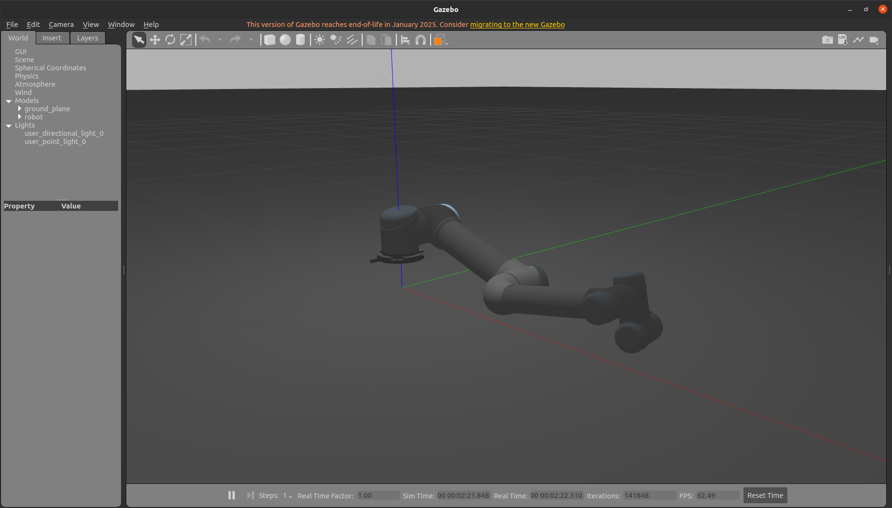
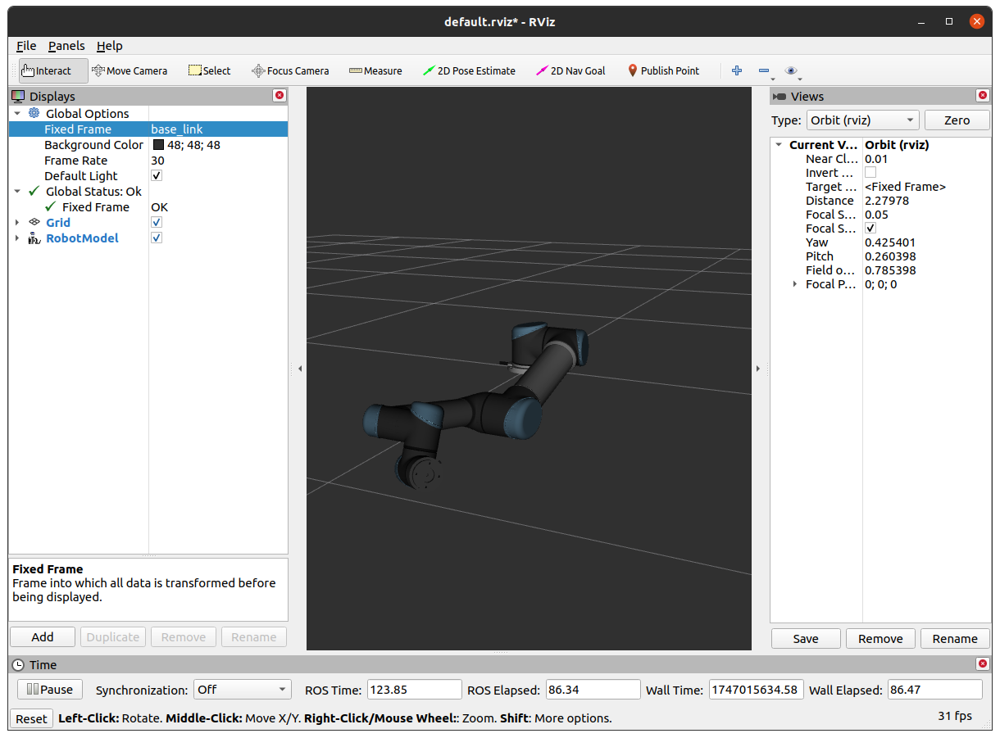

## ✅ Paso 6: Crear el archivo .xacro con la configuracion del robot dentro de lac Carpeta URDF(Unified Robot Description Format)
```
cd ~/catkin_ws_6
	Ejecutar: roslaunch moveit_setup_assistant setup_assistant.launch
````
Dar click en -> Edit Existing MoveIt Configuration Package
		Poner esta ruta: /home/gazebo-ros/catkin_ws_6/src/universal_robot/ur5_moveit_config
			Y darle a LOAD
		Ir a la parte de "Simulation" y copiar todo el texto
		Cerrar Movit Assistant
	Crear carpeta "urdf" dentro de la carpeta del package creado "ur5_v1" 
	Dentro, crear el archivo "ur5_1.xacro" y pegar ahi lo copiado
	Cambiar los "PositionJointInterface" por "EffortJointInterface"

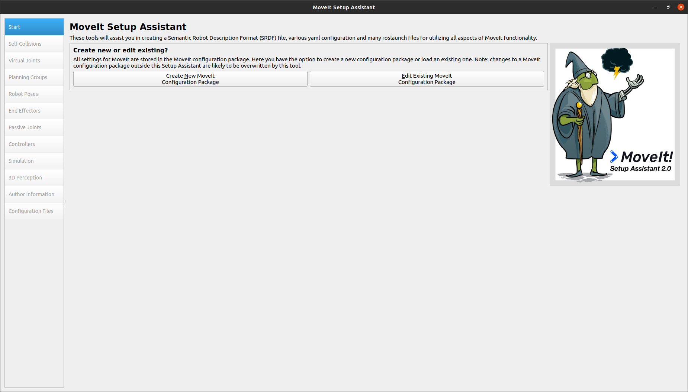
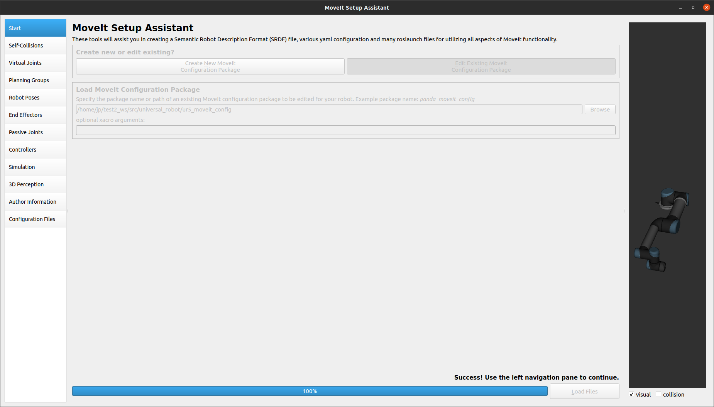
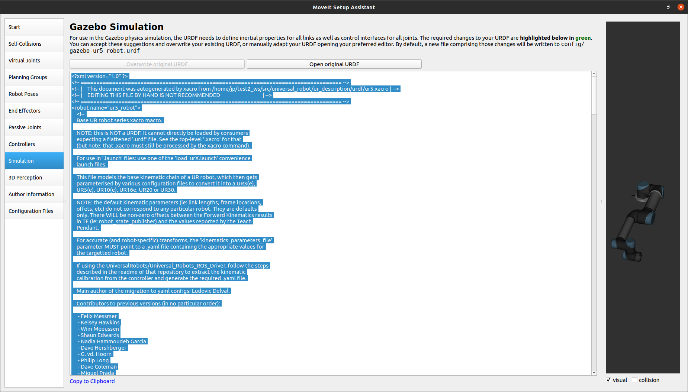

## ✅ Paso 7: Crear archivo launch para mostrar robot en rviz
Crear la carpeta launch dentro de . 
	Crear dentro, el archivo "rviz_ur5.launch"

En ese archivo se coloca lo siguiente, revisar que donde dice find si aparezca el nombre que tu tienes de tu carpeta y que el archivo xacro igual se llame igual que el que tu tienes: 
```
<?xml version="1.0"?>
<launch>

    <!-- Associate to the robot description parameter, the urdf file that model the robot-->
    <param name="robot_description" command = "$(find xacro)/xacro --inorder $(find ur5_v1)/urdf/ur5_4.xacro" />

    <!-- Read the joint value-->
    <node name="robot_state_publisher" pkg="robot_state_publisher" type="robot_state_publisher" />
    
    <!-- Visualization in Rviz-->
    <!--<node name="rviz" pkg="rviz" type="rviz" /> es por si no tienes una configuracion ya pre-guardada-->
    <node name="rviz" pkg="rviz" type="rviz" args= "-d $(find ur5_v1)/config/config.rviz" />

    <!-- Visualization of the use_gui for playing with joint-->
    <arg name="use_gui" default="true" />
    <node name="joint_state_publisher" pkg="joint_state_publisher" type="joint_state_publisher"  output="screen" unless="$(arg use_gui)" />
    <node name="joint_state_publisher_gui" pkg="joint_state_publisher_gui" type="joint_state_publisher_gui"  output="screen" if="$(arg use_gui)"/>    
    
</launch>
```
## ✅ Paso 8: Ejecutar rviz para guardar una config del robot. 
```
cd ~/catkin_ws_6
roslaunch ur5_v1 rviz_ur5.launch
```
No aparecerá el robot, pero se arregla ajustando ciertas configuraciones:
	Acomodar la visualización que nosotros querramos
		Fixed Frame -> base_link
		GlobalLinks → FixedFrame →base_link
		Grid → Plane Cell Count → 20
		Grid → Cell Size → 0.1
		En Displays → Add → :
				RobotModel
				TF
				MotionPlanning
		Crear la carpeta 'config' en ~/catkin_ws_6/src/ur5_v1. 
		Guardar la configuracion en esa carpeta con el nombre de "config.rviz"

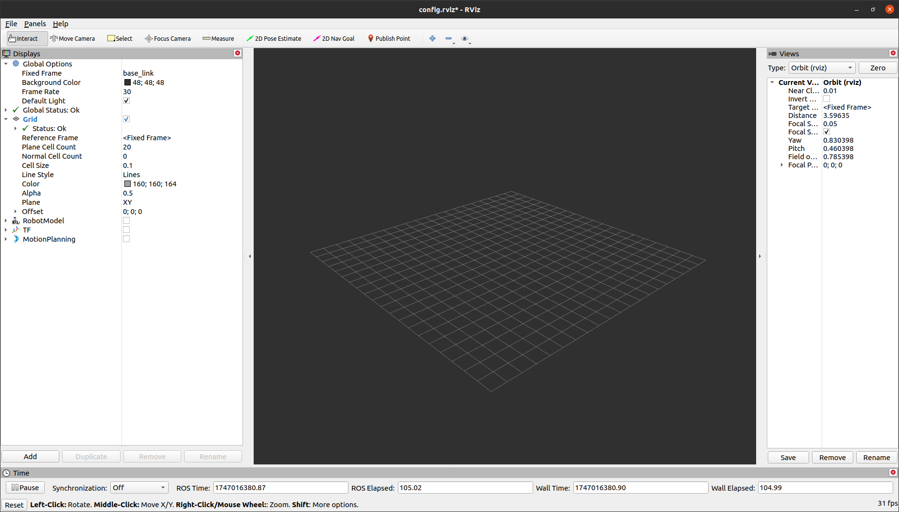
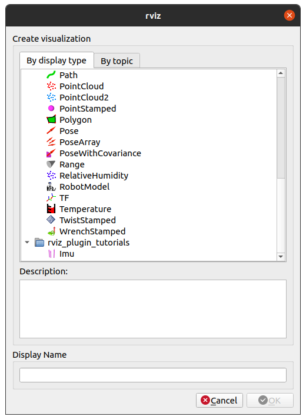
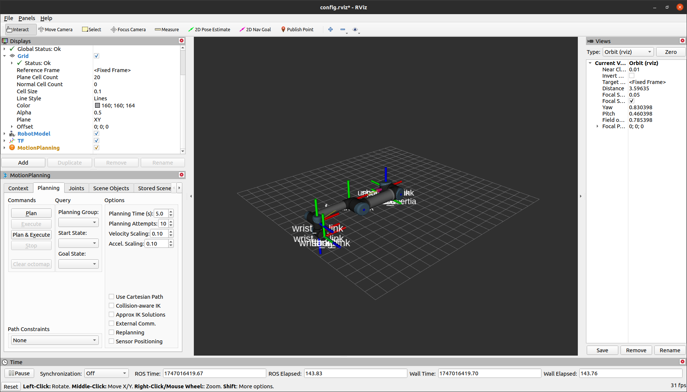

## ✅ Paso 9: Crear archivo de configuracion de los controladores
-Crear dentro de la carpeta ~/catkin_ws_6/src/ur5_v1/config, crear el archivo "ur5_controllers.yaml"

-Checar cual es el tipo de "HardwareInterface" en el archivo.xacro. 
En nuestro caso será "EffortController", pero esto quiere decir que necesitamos tunnear el PID. 
No lo haremos porque UR ya lo hizo. 
-Buscar el archivo: ~/catkin_ws_6/src/universal_robots/ur_gazebo/config/ur5_controller.yaml 
Copiar contenido y pegarlo en el que creamos nosotros.
-NO HACER, QUITE NOMBRE DE ur5 -->> NO funcionará porque asignamos el nombre de ur5, por lo tanto tenemos que asignar a los grupos de controladores el nombre el namespace que pusimos, osea "ur5". 
Para hacerlo, unicamente añadimos un "ur5:" hasta el inicio de todo y le damos tab al resto del codigo
-Nota: JointTrajectoryController es porque vamos a usar el plugin de RVIZ y ese usa JointTrajectoryController
-Nota: Usa un publish_rate alto (125 Hz), lo que puede mejorar la suavidad en simulación. Esto se ve en esta linea:
		publish_rate: &loop_hz 125 
		# publish rate más bajo (50 Hz) # suficiente para pruebas, pero menos suave.
## ✅ Paso 10: Crear un archivo para guardar un entorno mínimo para Gazebo en:  
```
ur5_v1/worlds/my_custom_world.world 
```
Eso te pone un piso y una mesa en la simulación.
## ✅ Paso 11: Hacer los siguientes 2 archivos launch en una nueva carpeta en ~/catkin_ws_6/src/ur5_v1/launch
```
ur5_gazebo_w1_1.launch
```
→ Gazebo con UR5 corriendo
→ Publica /robot_description, /tf, /joint_states
→ Carga controladores
```
ur5_moveit_with_rviz_1.launch
```
→ Lanzas ur5_moveit_with_rviz.launch → MoveIt + remapeo + RViz:
Ejecutar 2 terminales y en cada uno cada una de las sig instrucciones
NOTA: La simulacion en gazebo debe de estar en 'play' antes de mandar la 2da terminal 
			 o verificar esta linea en el primer launch:  <arg name="paused" value="false" />	
```
roslaunch ur5_v1 ur5_gazebo_w1_1.launch
```
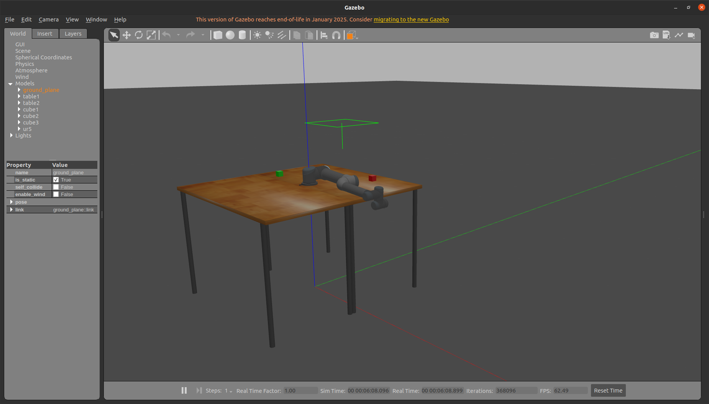
```
roslaunch ur5_v1 ur5_moveit_with_rviz_1.launch
```
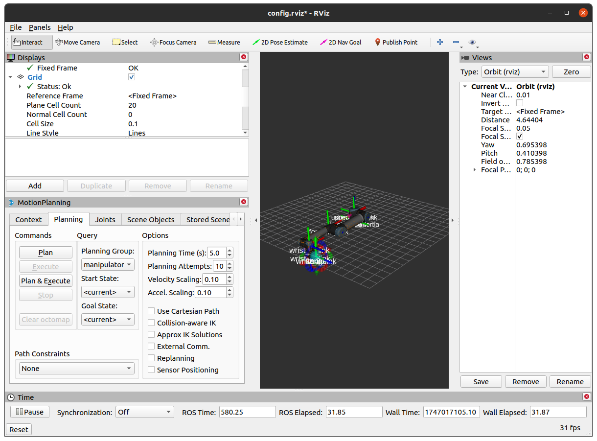


## ✅ Paso 12: Para poder ver la orientacion en rpy en vez de quaterniones que te da rviz. Tambien para ver la posicion en rviz en pantalla
Usamos dos scripts de python y los guradmos en una nueva carpeta llamada 'scripts'
Crear la carpeta 'scripts' en ~/catkin_ws_6/src/ur5_v1.
Los llamamos rpy_marker_rad.py y rpy_marker_deg.py
Les damos permisos de ejecucion manualmente o con:  chmod +x rpy_marker_rad.py
Les pegamos los codigo de abajo
Lo ejecutamos en nuevas terminales cada uno: 
 ```
rosrun ur5_v1 rpy_marker_rad.py
rosrun ur5_v1 rpy_marker_deg.py
```
En RViz: Add → Marker → MarkerTopic /rpy_marker_rad o /rpy_marker_deg
Guardar el archivo: config.rviz .Nota: no crear un nuevo archivo.rviz, solo guardar el que ya teniamos
## ✅ Paso 13: Para poder ver cuanto giran las articulaciones q1-q6 en rviz. 
Usamos el dos scripts de python en la misma carpeta 'scripts'
	Los llamamos joint_state_marker_rad.py y joint_state_marker_deg.py
	Les damos permisos de ejecucion manualmente o con:  chmod +x rpy_marker_rad.py
	Les pegamos los codigo de abajo
	Lo ejecutamos en nuevas terminales cada uno: 
 ```
rosrun ur5_v1 joint_state_marker_rad.py
rosrun ur5_v1 joint_state_marker_deg.py
 ```
En RViz: Add → Marker → MarkerTopic /joint_state_marker_rad o /joint_state_marker_deg	
Guardar el archivo: config.rviz .Nota: no crear un nuevo archivo.rviz, solo guardar el que ya teniamos
## ✅ Paso 14: Crear nuevo launch con la ejecucion de los 4 scripts pasados en el launch de moveit+Rviz
Crear una copia del archivo ur5_moveit_with_rviz_1.launch y llamarla ur5_moveit_with_rviz_2.launch
Añadir el siguiente codigo en ese archivo
```
<launch>
  <arg name="sim" default="true" />
  <arg name="debug" default="false" />

  <!-- Remapea trajectory controller para Gazebo -->
  <remap if="$(arg sim)" from="/scaled_pos_joint_traj_controller/follow_joint_trajectory" to="/eff_joint_traj_controller/follow_joint_trajectory"/>

  <!-- Lanza MoveIt  con la config de Universal Robots-->
  <include file="$(find ur5_moveit_config)/launch/move_group.launch">
    <arg name="debug" value="$(arg debug)" />
  </include>

  <!-- Lanza RViz con la configuración de RVIZ guardada en config -->
  <node name="rviz" pkg="rviz" type="rviz" output="screen"
        args="-d $(find ur5_v4)/config/config.rviz" />

  <!--______________________________________________________________________-->
  <!-- Nodo RPY en radianes -->
  <node name="rpy_marker_rad" pkg="ur5_v4" type="rpy_marker_rad.py" output="screen">
    <param name="reference_frame" value="base_link"/>
    <param name="target_frame" value="tool0"/>
  </node>

  <!-- Nodo RPY en grados -->
  <node name="rpy_marker_deg" pkg="ur5_v4" type="rpy_marker_deg.py" output="screen">
    <param name="reference_frame" value="base_link"/>
    <param name="target_frame" value="tool0"/>
  </node>

  <!-- Nodo joint_state_marker_rad -->
  <node name="joint_state_marker_rad" pkg="ur5_v4" type="joint_state_marker_rad.py" output="screen" />

  <!-- Nodo joint_state_marker_deg -->
  <node name="joint_state_marker_deg" pkg="ur5_v4" type="joint_state_marker_deg.py" output="screen" />

</launch>
```
## ✅ Paso 15: Descargar el gripper. 
Desde este github: https://github.com/philwall3/UR5-with-Robotiq-Gripper-and-Kinect/tree/master
Lo que se necesita principalmente, al menos para simulacion, esta en esta ruta: 
		robotiq_85_gripper-master/robotiq_85_description	
Pero para simplificar, se copia este repositorio en ~/catkin_ws_6/src:
```
cd ~/catkin_ws_6/src
git clone https://github.com/LearnRoboticsWROS/robotiq_description
cd ..
catkin_make
```
Cambiar el nombre de la carpeta que se creo de 'robotiq_description' a 'robotiq_gripper'
Probar que el gripper aparezca con:
```
roslaunch robotiq_gripper spawn_robotiq_85_gripper.launch
```
NOTA: El joint que se mueve para cerrar la garra es:
```
robotiq_85_left_knuckle_joint
```
-> va de 0 a 0.804
## ✅ Paso 16: Crear el nuevo archivo xacro para desplegar el ur5 con el gripper
Crear un nuevo archivo en la carpeta /ur5_v1/urdf llamado "ur5_1_gripper.xacro"	
	Copiar y pegar todo el contenido del archivo existente "ur5_1.xacro"
		Añadir despues de <robot name="ur5_robot"> y el comentario grande lo siguiente, o despues de la linea 61:
```
<xacro:include filename="$(find ur5_v1)/urdf/eef.xacro"/>
```
Reemplazar la line 6 por la siguiente:
```
<robot name="ur5_robot" xmlns:xacro="http://www.ros.org/wiki/xacro">	
```		
Crear en la misma carpeta el archivo "eef.xacro"
En ese archivo pegar el siguiente codigo:
```
<?xml version="1.0" ?>
<!--End Efector xacro file-->
<robot name="robotiq_85_gripper" xmlns:xacro="http://ros.org/wiki/xacro">

    
    <!-- Manda a llamar el xacro directo de robotiq_gripper package-->
    <xacro:include filename="$(find robotiq_gripper)/urdf/robotiq_85_gripper.urdf.xacro" />

    <!--This is where is gonna be the base link of the gripper in 
        relation to the tool0(which is the endefector of the robot)-->
    <xacro:robotiq_85_gripper prefix="" parent="tool0" >
        <origin xyz = "0 0 0" rpy = "0 -1.57 0" /> <!--Posicion inicial del gripper-->
    </xacro:robotiq_85_gripper>
</robot>
```
## ✅ Paso 17: Crear un launch para que aparezca el gripper como el end effector en rviz
Crear archivo llamado "rviz_ur5_gripper.launch"
	Copiar y pegar el codigo de abajo 
```
	cd ~/catkin_ws_6
	catkin_make
```

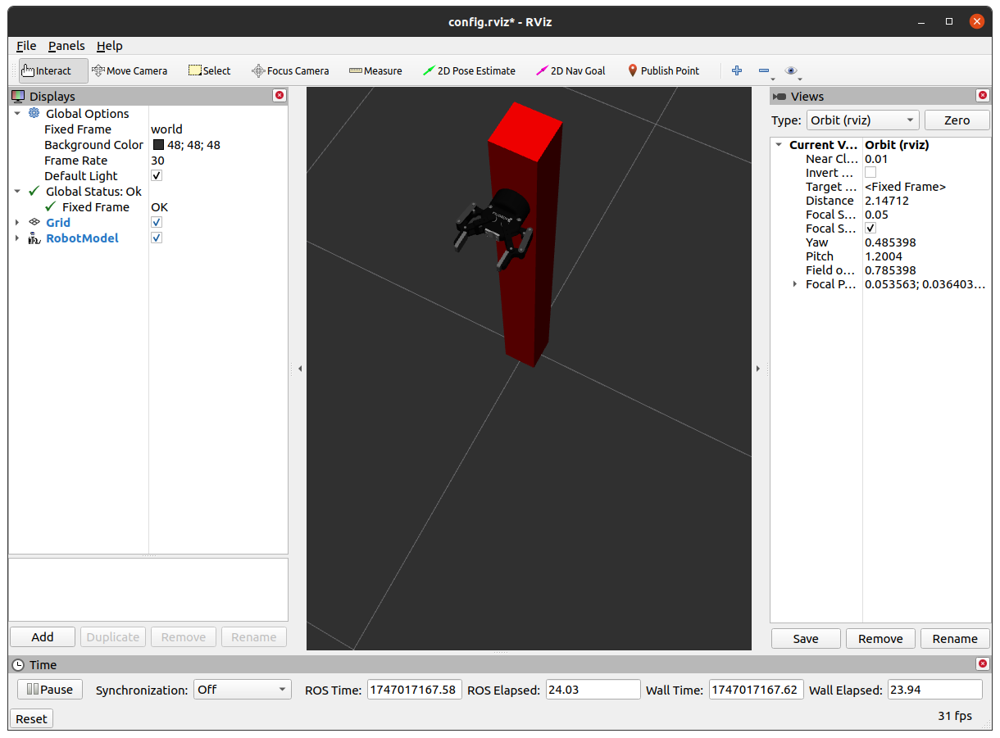

## ✅ Paso 18: Crear move it config package
En esta ruta:
/catkin_ws_4/src, crear esta carpeta: ur_gripper_moveit_configroslaunch moveit_setup_assistant setup_assistant.launch
Create New MoveIt ConfigurationPackage
Escoger la ruta -> /home/gazebo-ros/catkin_ws_6/src/ur5_v1/urdf/ur5_1_gripper.xacro

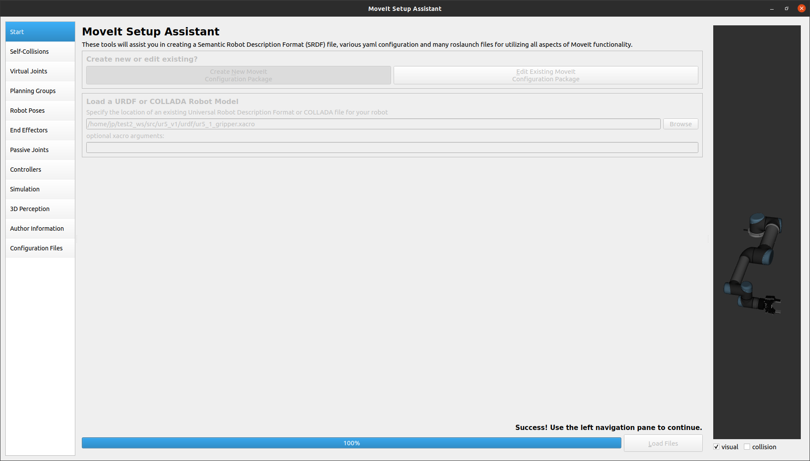

Ir a Self-Collisions -> Generate Collision Matrix
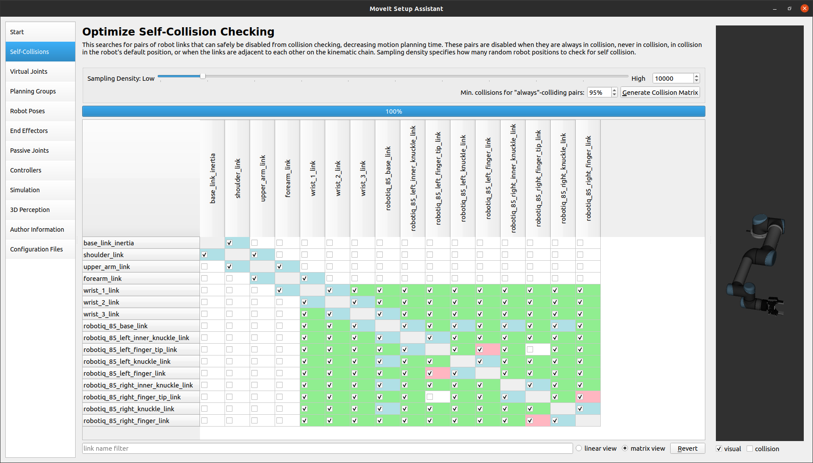


Ir a planning group ->
Add Group -> Colocar la sig Configuracion
	Group Name: manipulator
	Kinematic Solver: kdl_kinematics_plugin/KDLKinematicsPlugin
	Group Default Planner: RRT
	Add joints -> seleccionar de shoulder_pan_joint al wrist_3_joint (Son 6 en total)-> Save
	Add link -> base_link, de shoulder_link a wrist_3_link, flange, tool0 (Son 9 en total)-> Save

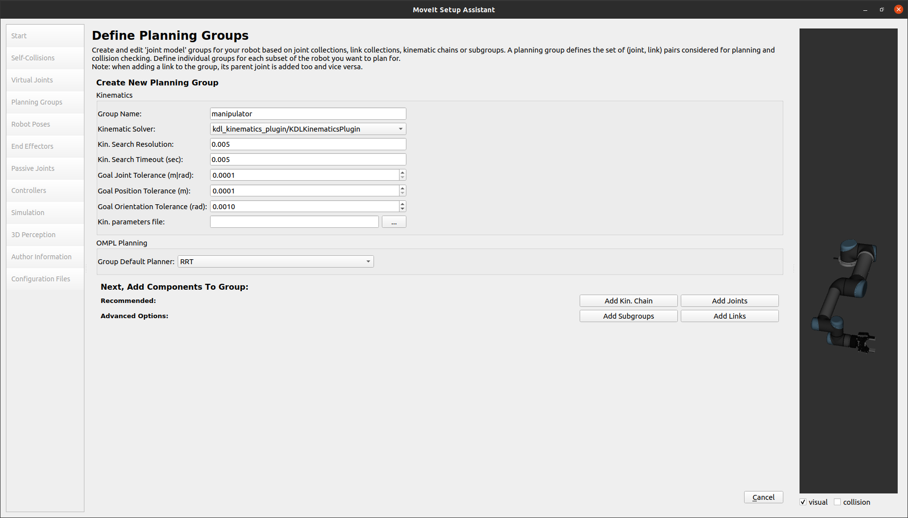

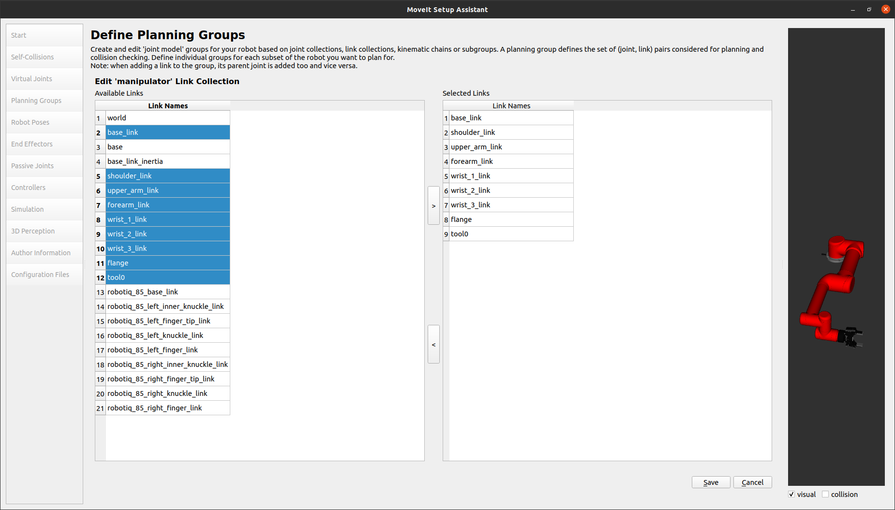

			
Add Group -> Colocar la sig Configuracion
			Group Name:	gripper
			Kinematic Solver: none
			Group Default Planner: none
	
Add joints -> seleccionar robotiq_85_left_knuckle_joint -> Save
Add link -> seleccionar todos los robotiq_85_ (Son: 1 base, 4 left y 4 right) -> Save

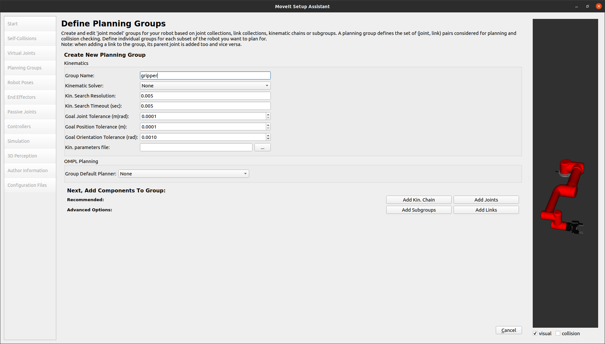
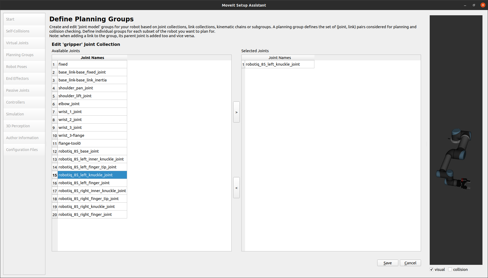
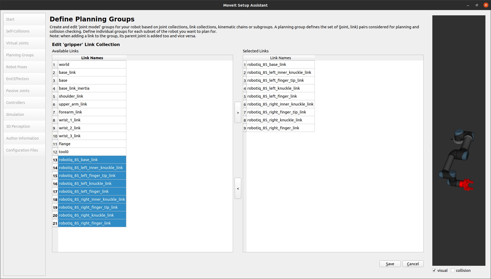
	
Ir a Robot Poses -> Add pose. Añadir las siguientes:
		"zero" - Planning Group: manipulator - Todas art en 0.
		"home" - Planning Group: manipulator - shoulder_lift_joint=-1.57rad=90°, wrist1= -1.57rad. El resto en 0
		"open" - Planning Group: gripper - left_knuckle: 0
		"close" - Planning Group: gripper - left_knuckle: 0.8040

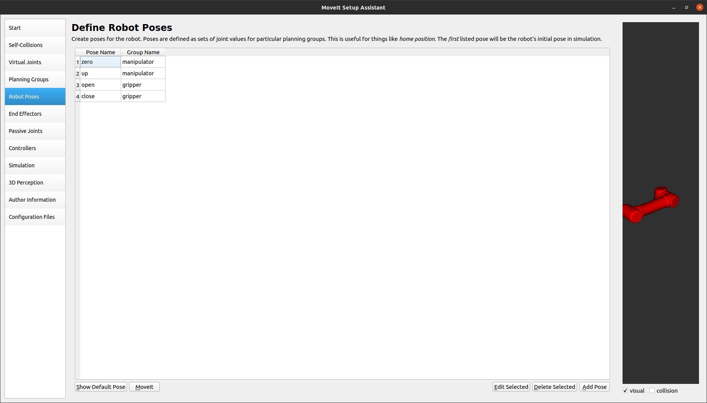
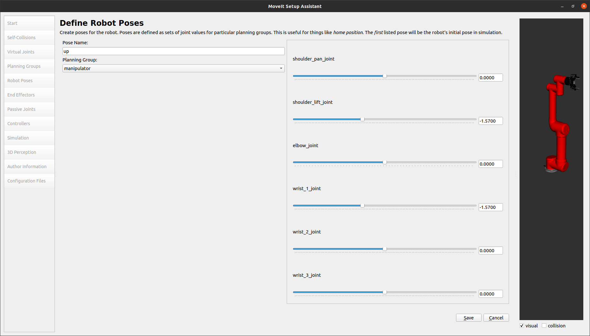
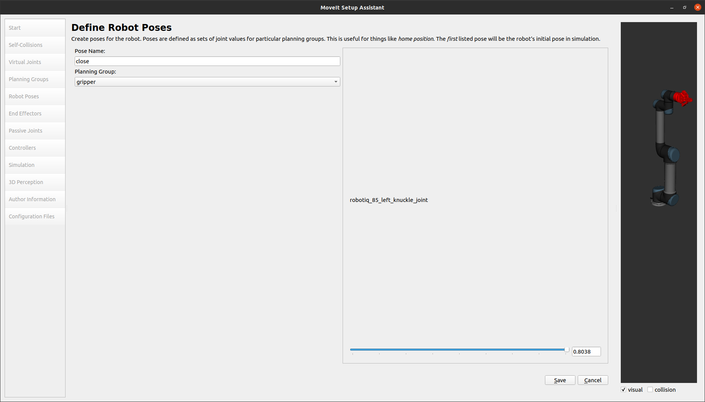

	
Ir a End Effectors -> Add ->
		End Effector Name -> robotiq_gripper
		End Effector Group -> gripper
		Parent Link -> tool0

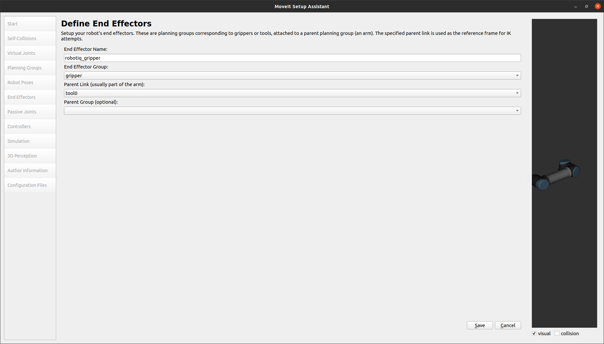

	
Ir a  Passive Joints -> 
		Añadir -> 
			robotiq_85_left_finger_joint
			robotiq_85_right_finger_joint

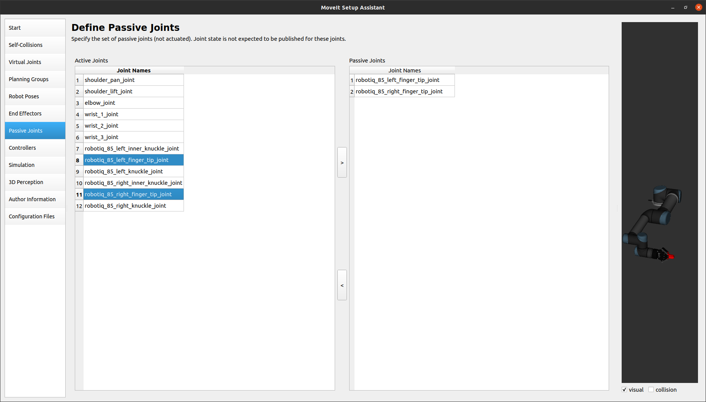

 
Ir a controllers 
	Dejar vacio
		
Ir a Author Information y llenar los campos solicitados

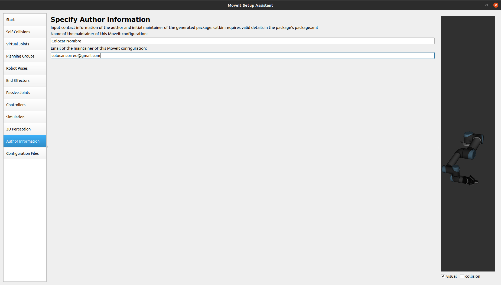

 
Ir a Configuration Files -> ajustar ruta a /catkin_ws_4/src/ur_gripper_moveit_config -> Generate Packages

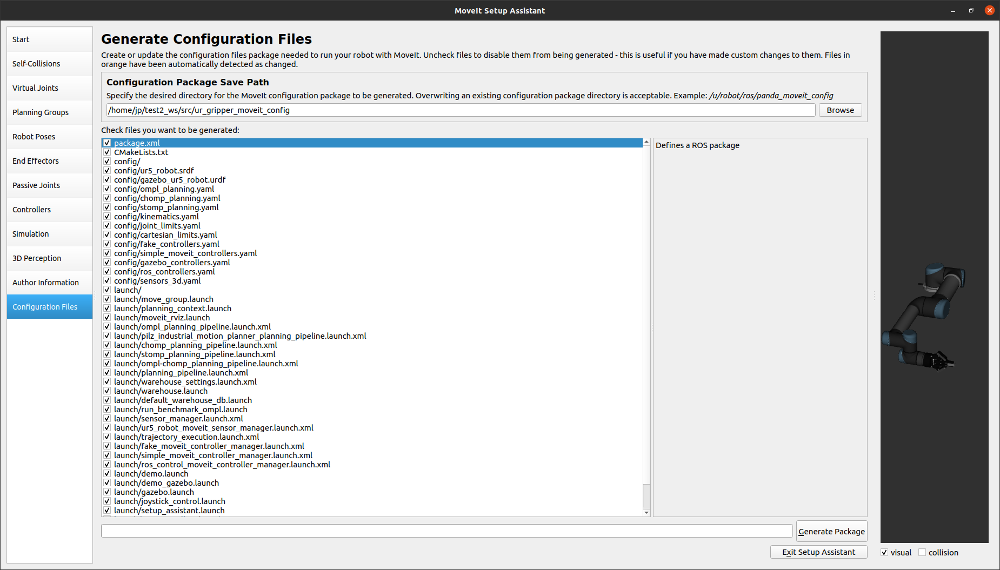

	
Exit MoveIt Assistant
	
En la nueva carpeta, buscar el archivo con esta ruta /ur_gripper_moveit_config/config/ros_controllers.yaml
		Añadir ahi el siguiente código:
```
controller_list:
- name: "/eff_joint_traj_controller"
  action_ns: follow_joint_trajectory
  type: FollowJointTrajectory
  joints:
    - shoulder_pan_joint
    - shoulder_lift_joint
    - elbow_joint
    - wrist_1_joint
    - wrist_2_joint
    - wrist_3_joint

- name: "/gripper_controller"
  action_ns: follow_joint_trajectory
  type: FollowJointTrajectory
  joints:
    - robotiq_85_left_knuckle_joint
```
Ahora en esta ruta /ur_gripper_moveit_config/launch, crear un  nuevo archivo llamado "ur5_robot_moveit_controller_manager.launch"
		Añadir ahi el siguiente código:
```
<launch>

    <arg name = "moveit_controller_manager" default "moveit_simple_controller_manager/MoveItSimpleControllerManager" />
    <param name = "moveit_controller_manager" value = "$(arg moveit_controller_manager)" />

    <!-- load ros_controllers to the param server -->
    <rosparam file ="$(find ur_gripper_moveit_config)/config/ros_controllers.yaml" />


</launch>
```
Revisar que esta ocurriendo con este package por lo tanto lanzamos el demo del package:
	roslaunch ur_gripper_moveit_config demo.launch
## ✅ Paso 19: Realizar estos ajustes para que se vea correctamente el gripper
###Entrar a cada uno de estos archivos:
/home/gazebo-ros/catkin_ws_6/src/ur_gripper_moveit_config/config/gazebo_ur5_with_gripper.urdf
/home/gazebo-ros/catkin_ws_6/src/robotiq_gripper/urdf/robotiq_85_gripper.transmission.xacro
EL ARCHIVO "gazebo_ur5_with_gripper.urdf" ES EN REALIDAD "gazebo_ur5_robot.urdf"
###Quitar todos los: libroboticsgroup_upatras_gazebo_mimic_joint_plugin
###Reemplazar por esto: libroboticsgroup_gazebo_mimic_joint_plugin
###Entrar a cada uno de estos otros archivos
/home/gazebo-ros/catkin_ws_5/src/ur_gripper_moveit_config/config/gazebo_ur5_with_gripper.urdf
/home/gazebo-ros/catkin_ws_5/src/robotiq_gripper/urdf/robotiq_85_gripper.urdf.xacro 

###Cambiar de continous a fixed tanto para el 'robotiq_85_left_finger_joint' como para el 'robotiq_85_right_finger_joint'
Lo verás líneas así: 	<joint name="robotiq_85_left_finger_joint" type="continous">
			<joint name="${prefix}robotiq_85_left_finger_joint" type="continuous">
			<joint name="robotiq_85_right_finger_joint" type="continous">
			<joint name="${prefix}robotiq_85_right_finger_joint" type="continuous">
   Te quedará así: <joint name="robotiq_85_left_finger_joint" type="fixed">
			<joint name="${prefix}robotiq_85_left_finger_joint" type="fixed">
			<joint name="robotiq_85_right_finger_joint" type="fixed">
			<joint name="${prefix}robotiq_85_right_finger_joint" type="fixed">
	cd ~/catkin_ws_6
	catkin_make
 
## ✅ Paso 20: Crear nuevo configuration.yaml con el gripper añadido
Realizar una copia de ur5_controllers.yaml
Renombrarlo como ur5_gripper_controllers.yaml
Añadir hasta abajo el siguiente código:
```
gripper_controller:
    type: position_controllers/JointTrajectoryController
    joints:
      - robotiq_85_left_knuckle_joint
    gains:
      robotiq_85_left_knuckle_joint: {p: 100,  d: 1, i: 1, i_clamp: 1}
    constraints:
        goal_time: 0.6
        stopped_velocity_tolerance: 0.05
        robotiq_85_left_knuckle_joint: {trajectory: 0.1, goal: 0.1}
    stop_trajectory_duration: 0.5
    state_publish_rate:  25
    action_monitor_rate: 10
```
## ✅ Paso 21: Crear nuevo launch file para Gazebo en ur5_v1/launch
Realizar una copia de ur5_gazebo_w1_1.launch
Renombrarlo como ur5_gripper_gazebo_w1_1.launch
	
Lo que debemos de cambiar es el nombre del xacro file
De: <param name="robot_description" command="$(find xacro)/xacro '$(find ur5_v1)/urdf/ur5_1.xacro'" /> 
A: <param name="robot_description" command="$(find xacro)/xacro '$(find ur5_1)/urdf/ur5_1_gripper.xacro'" />  

Cambiar el archivo controller.yaml al que llamamos:
De: <rosparam file="$(find ur5_v1)/config/ur5_controllers.yaml" command="load"/>
A: <rosparam file="$(find ur5_v1)/config/ur5_controllers_gripper.yaml" command="load"/>

Añadir a los args de los controladores al final el del griper.
De:args="joint_state_controller 
	      eff_joint_traj_controller 
	      --timeout 60 " />
	 
A: args="joint_state_controller 
	      eff_joint_traj_controller 
	      gripper_controller 
	      --timeout 60 " />
	      
El codigo completo queda asi: 
```
<?xml version="1.0"?>
<launch>

    <!-- Cargar el modelo UR5 -->
    <param name="robot_description" command="$(find xacro)/xacro '$(find ur5_v1)/urdf/ur5_1.xacro'" /> 
   
    <!--Spawn Robot in Gazebo-->
    <!-- Set the position in empty world of the base link-->
    <arg name="x" default="0" />
    <arg name="y" default="0" />
    <arg name="z" default="1.015" />

    <!-- put world file as argument-->
    <arg name="world_file" default = "$(find ur5_v1)/worlds/my_custom_world.world" />

    <!-- Lanzar Gazebo con tu mundo -->
    <include file="$(find gazebo_ros)/launch/empty_world.launch">
        <arg name="paused" value="false"/>
        <arg name="gui" value="true"/>
        <arg name="use_sim_time" value="true"/>
        <arg name="world_name" value="$(arg world_file)"/>
    </include>

    <!-- Publicar estados del robot -->
    <node name="robot_state_publisher" pkg="robot_state_publisher" type="robot_state_publisher"/>
    
    <!-- Spawn the robot using the package gazebo_ros-->
    <node name="spawn_the_robot" pkg="gazebo_ros" type="spawn_model"  output="screen" args="-urdf -param robot_description -model ur5 -x $(arg x) -y $(arg y) -z $(arg z)" />  

    <!-- Controladores -->
    <!-- Cargar Controladores -->
    <rosparam file="$(find ur5_v1)/config/ur5_controllers.yaml" command="load"/>
  
    <!-- Cargar the node Controller manager -->
    <node name="controller_spawner" pkg="controller_manager" type="spawner"
      args="joint_state_controller 
      eff_joint_traj_controller 
      --timeout 60 " />

</launch>
```
## ✅ Paso 22: Crear nuevo launch file para MoveIt con Rviz ya con el gripper integrado
Realizar una copia de ur5_moveit_with_rviz_2.launch
Renombrarlo como ur5_gripper_moveit_with_rviz_1.launch
	
Cambiar la carpeta moveit_config por la creada por nosotros:
De: <include file="$(find ur5_moveit_config)/launch/move_group.launch">
A: <include file="$(find ur_gripper_moveit_config)/launch/move_group.launch">
	
O aqui está todo el codigo: 
```
<launch>
  <arg name="sim" default="true" />
  <arg name="debug" default="false" />

  <!-- Remapea trajectory controller para Gazebo -->
  <remap if="$(arg sim)" from="/scaled_pos_joint_traj_controller/follow_joint_trajectory" to="/eff_joint_traj_controller/follow_joint_trajectory"/>

  <!-- Lanza MoveIt  con la config hecha y ubicada en la carpeta ur_gripper_moveit_config-->
  <include file="$(find ur_gripper_moveit_config)/launch/move_group.launch">
    <arg name="debug" value="$(arg debug)" />
  </include>

  <!-- Lanza RViz con la configuración de RVIZ guardada en config -->
  <node name="rviz" pkg="rviz" type="rviz" output="screen"
        args="-d $(find ur5_v1)/config/config.rviz" />

  <!--______________________________________________________________________-->
  <!-- Nodo RPY en radianes -->
  <node name="rpy_marker_rad" pkg="ur5_v1" type="rpy_marker_rad.py" output="screen">
    <param name="reference_frame" value="base_link"/>
    <param name="target_frame" value="tool0"/>
  </node>

  <!-- Nodo RPY en grados -->
  <node name="rpy_marker_deg" pkg="ur5_v1" type="rpy_marker_deg.py" output="screen">
    <param name="reference_frame" value="base_link"/>
    <param name="target_frame" value="tool0"/>
  </node>

  <!-- Nodo joint_state_marker_rad -->
  <node name="joint_state_marker_rad" pkg="ur5_v1" type="joint_state_marker_rad.py" output="screen" />

  <!-- Nodo joint_state_marker_deg -->
  <node name="joint_state_marker_deg" pkg="ur5_v1" type="joint_state_marker_deg.py" output="screen" />

</launch>
```
## ✅ Paso 23: Crear nuevo launch donde ejecute Gazebo-moveIt-Rviz
Es basicamente juntar los dos launch pasados..
	En la carpeta launch crear el siguiente archivo 'ur5_gripper_gazebo_moveit_rviz_w1_1.launch'
	El código es el siguiente:
```
<?xml version="1.0"?>
<launch>

    <!-- Cargar el modelo UR5 -->
    <param name="robot_description" command="$(find xacro)/xacro '$(find ur5_v1)/urdf/ur5_4_gripper.xacro'" /> 
   
    <!--Spawn Robot in Gazebo-->
    <!-- Set the position in empty world of the base link-->
    <arg name="x" default="0" />
    <arg name="y" default="0" />
    <arg name="z" default="1.015" />

    <!-- put world file as argument-->
    <arg name="world_file" default = "$(find ur5_v1)/worlds/my_custom_world.world" />

    <!-- Lanzar Gazebo con tu mundo -->
    <include file="$(find gazebo_ros)/launch/empty_world.launch">
        <arg name="paused" value="true"/>
        <arg name="gui" value="true"/>
        <arg name="use_sim_time" value="true"/>
        <arg name="world_name" value="$(arg world_file)"/>
    </include>

    <!-- Publicar estados del robot -->
    <node name="robot_state_publisher" pkg="robot_state_publisher" type="robot_state_publisher"/>
    
    <!-- Spawn the robot using the package gazebo_ros-->
    <node name="spawn_the_robot" pkg="gazebo_ros" type="spawn_model"  output="screen" args="-urdf -param robot_description -model ur5 -x $(arg x) -y $(arg y) -z $(arg z)" />  

    <!-- Controladores -->
    <!-- Cargar Controladores -->
    <rosparam file="$(find ur5_v1)/config/ur5_gripper_controllers.yaml" command="load"/>
  
    <!-- Cargar the node Controller manager -->
    <node name="controller_spawner" pkg="controller_manager" type="spawner"
      args="joint_state_controller 
      eff_joint_traj_controller 
      gripper_controller 
      --timeout 60 " />

    <arg name="sim" default="true" />
    <arg name="debug" default="false" />

    <!-- Remapea trajectory controller para Gazebo -->
    <remap if="$(arg sim)" from="/scaled_pos_joint_traj_controller/follow_joint_trajectory" to="/eff_joint_traj_controller/follow_joint_trajectory"/>

    <!-- Lanza MoveIt  con la config hecha y ubicada en la carpeta ur_gripper_moveit_config-->
    <include file="$(find ur_gripper_moveit_config)/launch/move_group.launch">
        <arg name="debug" value="$(arg debug)" />
    </include>

    <!-- Lanza RViz con la configuración de RVIZ guardada en config -->
    <node name="rviz" pkg="rviz" type="rviz" output="screen"
            args="-d $(find ur5_v1)/config/config.rviz" />

    <!--______________________________________________________________________-->
    <!-- Nodo RPY en radianes -->
    <node name="rpy_marker_rad" pkg="ur5_v1" type="rpy_marker_rad.py" output="screen">
        <param name="reference_frame" value="base_link"/>
        <param name="target_frame" value="tool0"/>
    </node>

    <!-- Nodo RPY en grados -->
    <node name="rpy_marker_deg" pkg="ur5_v1" type="rpy_marker_deg.py" output="screen">
        <param name="reference_frame" value="base_link"/>
        <param name="target_frame" value="tool0"/>
    </node>

    <!-- Nodo joint_state_marker_rad -->
    <node name="joint_state_marker_rad" pkg="ur5_v1" type="joint_state_marker_rad.py" output="screen" />

    <!-- Nodo joint_state_marker_deg -->
    <node name="joint_state_marker_deg" pkg="ur5_v1" type="joint_state_marker_deg.py" output="screen" />


</launch>
```
Al ejecutarlo darle 'Play' y despues de eso ya va a arrancar rviz

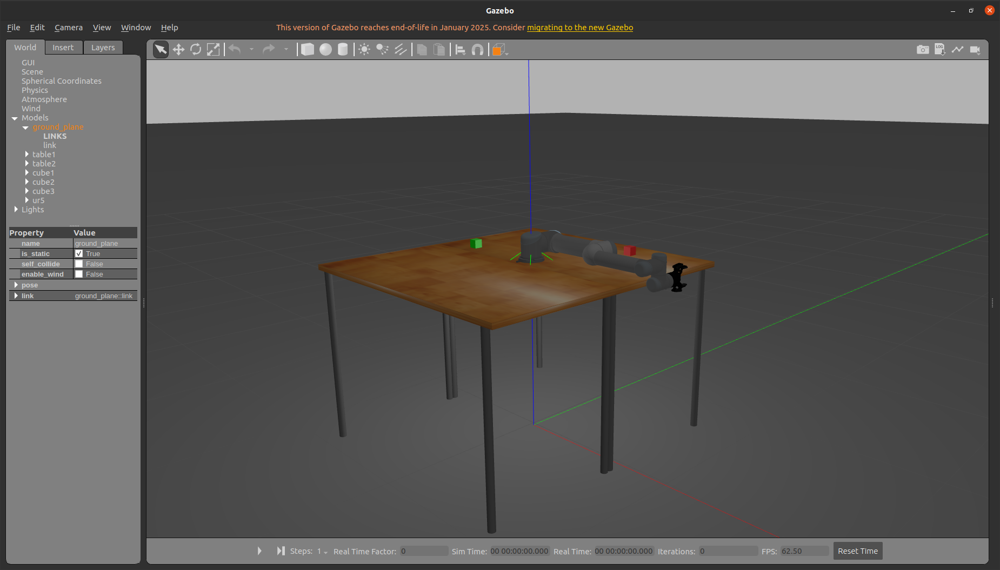

## ✅ Paso 24: Cambiar los group de open y close de la garra para quitar los joints de los fingers que no se usan
Cambiar de esto:
```
<group_state name="open" group="gripper">
        <joint name="robotiq_85_left_finger_joint" value="0"/>
        <joint name="robotiq_85_left_knuckle_joint" value="0"/>
        <joint name="robotiq_85_right_finger_joint" value="0"/>
    </group_state>
    <group_state name="close" group="gripper">
        <joint name="robotiq_85_left_finger_joint" value="0"/>
        <joint name="robotiq_85_left_knuckle_joint" value="0.803"/>
        <joint name="robotiq_85_right_finger_joint" value="0"/>
    </group_state>	
```
Poner esto:
```
<group_state name="open" group="gripper">
        <joint name="robotiq_85_left_knuckle_joint" value="0"/>
    </group_state>
    <group_state name="close" group="gripper">
        <joint name="robotiq_85_left_knuckle_joint" value="0.803"/>
    </group_state>	
```
## ✅ Paso 25: Para cambiar la rotacion inicial del gripper en el archivo "eef.xacro"
Solo alterar los rpy
	En esta linea: <origin xyz = "0 0 0" rpy = "0 -1.57 0" /> <!--Posicion inicial del gripper-->
## Paso 26: Crear nuevo archivo python en la carpeta 'scripts' llamado "ur5_set_initial_pose.py"
Darle permisos de ejecucion al archivo, hay 2 opciones:
		-En Archivos buscar el archivo python, darle en Propiedades -> Permisos -> Permitir ejecutar el archivo como un programa
		-En terminal: chmod +x 'ur5_set_initial_pose.py'
	Copiar y pegar texto.	
```
#!/usr/bin/env python3

import rospy
from controller_manager_msgs.srv import ListControllers
from trajectory_msgs.msg import JointTrajectory, JointTrajectoryPoint

def wait_for_controller():
    rospy.wait_for_service('/controller_manager/list_controllers')
    list_controllers = rospy.ServiceProxy('/controller_manager/list_controllers', ListControllers)
    while not rospy.is_shutdown():
        controllers = list_controllers()
        for c in controllers.controller:
            if c.name == 'eff_joint_traj_controller' and c.state == 'running':
                rospy.loginfo('Controller is running.')
                return
        rospy.loginfo('Waiting for eff_joint_traj_controller to be running...')
        rospy.sleep(1)

def send_initial_pose():
    pub = rospy.Publisher('/eff_joint_traj_controller/command', JointTrajectory, queue_size=10)
    rospy.sleep(1)  # give publisher time to connect

    traj = JointTrajectory()
    traj.joint_names = [
        'shoulder_pan_joint', 'shoulder_lift_joint', 'elbow_joint',
        'wrist_1_joint', 'wrist_2_joint', 'wrist_3_joint'
    ]
    point = JointTrajectoryPoint()
    point.positions = [0.0, -1.57, 0, -1.57, 0.0, 0.0]
    point.velocities = [0.0] * 6
    point.time_from_start = rospy.Duration(1.0)
    traj.points.append(point)

    rospy.loginfo('Publishing initial pose...')
    pub.publish(traj)
    rospy.loginfo('Initial pose published.')

if __name__ == '__main__':
    rospy.init_node('set_initial_pose')
    wait_for_controller()
    send_initial_pose()
```
---
## Ejecutables para realizar pruebas


## ✅ Conclusión

Este tutorial documenta todo el proceso necesario para simular el robot UR5 con un gripper Robotiq 85 en ROS,
incluyendo la instalación de dependencias, la clonación de paquetes, la configuración de MoveIt y el lanzamiento
correcto en Gazebo y RViz.

Gracias a esta guía, es posible tener un entorno funcional para pruebas con el UR5 en ROS, dejando todo listo para
futuros desarrollos como scripts de movimiento, integración con visión, o secuencias de pick and place.

Además, se explicaron los archivos clave que deben modificarse, como los controladores, URDFs, y launch files, 
lo que ayuda a entender cómo se estructura un sistema completo de simulación con ROS.


---

## 📚 Referencias y Recursos Adicionales

Enlace a documentación oficial:  
https://wiki.ros.org/noetic

Tutoriales relacionados:  
https://ros-planning.github.io/moveit_tutorials/  
http://wiki.ros.org/Industrial/Tutorials

Repositorio de código fuente:  
https://github.com/YeredBC/TURORIAL-ROS.git

---

## 📬 Contacto

Para preguntas o sugerencias:
- Asesor: Cesar Martinez Torres
  - 🔗 GitHub: https://github.com/cesar-martinez-torres/UDLAP_Robotics.git
  - 📧 Correo electrónico: cesar.martinez@udlap.mx

* Nombre: Juan Pablo Rosas Pineda:
	* 🔗 GitHub: https://github.com/RosasJP17
	* 📧 Correo electrónico: juan.rosaspa@udlap.mx
  
  
* Nombre: Cesar Maximiliano Gutierrez Velazquez
	* 📧 Correo electrónico: cesar.gutierrezvz@udlap.mx

  
* Nombre: Antonio De Jesus Xicali Arriaga
	* 🔗 GitHub: https://github.com/AntonioXicali101
	* 📧 Correo electrónico: antonio.xicaliaa@udlap.mx

   
* Nombre: Yered Yosshiel Bojorquez Castillo
	* 🔗 GitHub: https://github.com/YeredBC
	* 📧 Correo electrónico: yered.bojorquezco@udlap.mx

---
